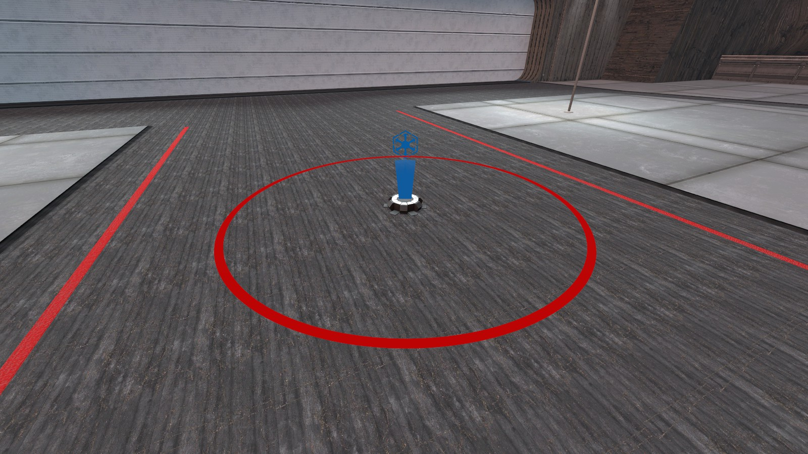
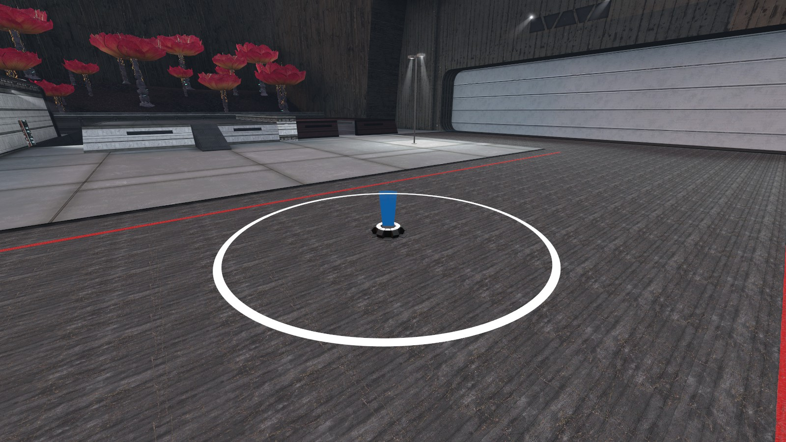

# TrimProd
Hello, I'm TrimProd a French developer working mainly as a freelancer or for big personal projects. Developer since 2017 I love to learn more and more languages

## Languages & Tools

[][discord]
[][discord]
[][discord]
[][discord]
[][discord]
[][discord]
[][discord]
[][discord]
[][discord]
[][discord]
[][discord]
[][discord]
[][discord]
 
 

<table>
<tr>
<td>
  
  
</td>
<td>
Area capture system for Garry's Mod (StarWars style)
</td>
</tr>
</table>

 
 

## Github Stat

[discord]: https://discord.gg/GwUQTS8MZn
